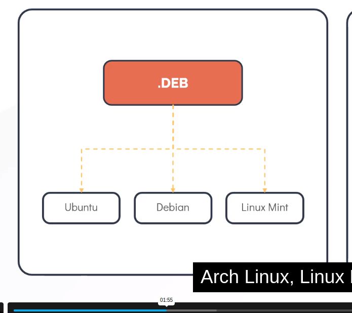
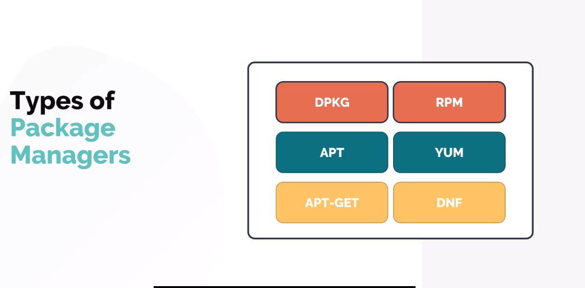

## APT (Advanced Packet Technology)

- What is Debian-based Linux distributions?
A family of operating systems that are built on the Debian operating system. They use the same APT (Advance Packaging Tool) for package management system. Some of the most popular Debian-based Linux distributions have different features but come under the same underlying Debian system and package management tools are Linux Mint, Ubuntu and kali Linux. 

One must know when we talk about Red Hat-based distributions like CentOS and Fedora, they are Linux distributions but not Debian-based Linux distributions. Red Hat-based Linux distributions are often preferred for enterprise environments and servers, focusing on stability and security. Whereas Debian-based Linux distributions moreover focus on long-term 

Dpkg is a base package management system for the Debian Linux family, it is used to install, remove, store, and provide information about .deb packages.

It is a low-level tool and there are front-end tools that help users to obtain packages from remote repositories and/or handle complex package relations these include:

## APT (Advanced Packaging Tool)
It is a very popular, free, powerful, and more so, useful command line package management system that is a front end for the dpkg package management system.

Users of Debian or its derivatives such as Ubuntu and Linux Mint should be familiar with this package management tool.

To understand how it actually works, you can go over these how-to guides:
2. RPM (Red Hat Package Manager)
This is the Linux Standard Base packing format and a base package management system created by RedHat. Being the underlying system, there are several front-end package management tools that you can use with it and but we shall only look at the best and that is:

 ### YUM (Yellowdog Updater, Modified)
It is an open-source and popular command line package manager that works as an interface for users to RPM. You can compare it to APT under Debian Linux systems, it incorporates the common functionalities that APT has.
Yum Works on rpm based systems
DNF – Dandified Yum
It is also a package manager for RPM-based distributions, introduced in Fedora 18 and it is the next generation of the version of YUM.

If you have been using Fedora 22 onwards, you must have realized that it is the default package manager. Here are some links that will provide you with more information about DNF and how to use it:
### DNF – Dandified Yum
It is also a package manager for RPM-based distributions, introduced in Fedora 18 and it is the next generation of the version of YUM.
 -  Portage Package Manager – Gentoo

 - Zypper Package Manager – openSUSE
 -  Pacman Package Manager – Arch Linux
 