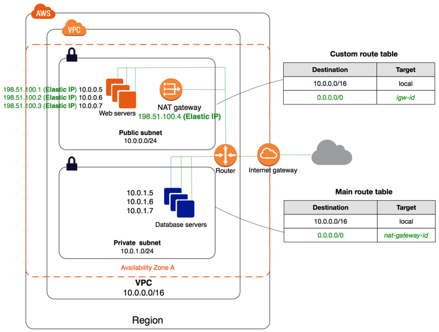

Subnet

A route table contains a set of rules, called routes, that are used to determine where network traffic from your VPC is directed. You can explicitly associate a subnet with a particular route table. Otherwise, the subnet is implicitly associated with the main route table.

Create VPC
Goto Network Settings
CREATE VPC
private address ranges

CIDR 
2^32
ho sakte hai
00000000.0000000.0000000.0000000
11111111.1111111.1111111.1111111
Classless InterRouting domain

/24
/

Create first vpc 
192.168.0.0/16
bahut bada network 
subnet- dividing into smaller networks
network1:
192.168.1.0/24
192.18.1.0.-192.18.1.255
network 2:
192.168.2.0/24
192.168.2.0-192.168.2.255
network 3:
192.168.3.0/24
192.168.3.0-192.168.2.255

How to make subnet i got it 
why we are rquiring subnetting 
1. network range will get again shorter

Internet Gateway (IGW) and Route Table

0.0.0.0  to public mai jayagea
72.31.0.0/16 is range ka aye to bahar connect hi nahi kar payega
local network
 make reqest to nginx server and then maintain prox and then call application server
jump server (Bastion Server)
network address translation
proxy server
www/share/html

nat-instance - 1.2.3.4
private-instance- 8.8.8.8

Routing and Traffic Management: Each subnet has its own routing table, which allows you to control how traffic flows within and between subnets. For instance, you can configure routes to direct traffic between subnets, to the internet, or to other network devices like VPN gateways or NAT gateways.

Public and Private Subnets: You might have one route table for your public subnets, containing routes to an Internet Gateway (IGW) for internet-bound traffic, and another route table for your private subnets, which may not have routes to the IGW.
Custom Routing: You might create additional route tables to handle specific types of traffic. For instance, you could create a route table for a subnet dedicated to communication with an on-premises network via a VPN connection, or for a subnet that requires access to a specific service endpoint within AWS.
Isolation and Segmentation: You can use multiple route tables to segment your network and enforce isolation between different parts of your infrastructure, providing additional security and control over network traffic flows.

AWS reserves 5 IP addresses (first 4 and last 1 IP address) in each subnet. These 5 IPs are not available for use and can not be assigned to an instance.
Ex, if CIDR block 10.0.0.0/24, reserved IP are:
- 10.0.0.0 - Network Address
- 10.0.0.1 - Reserved by AWS for the VPC router.
- 10.0.0.2 - Reserved by AWS for mapping to Amazon-provided DNS
- 10.0.0.3 - Reserved by AWS for future use
- 10.0.0.255 - Network broadcast address. AWS does not support broadcast in a VPC, therefore the address is reserved.
If we need 29 IP address for EC2 instance, we can't choose a subnet of size /27 (32 IP).
We need to choose /26 (64 IP) subnet size. Because AWS reserves 5 IP addresses in each subnet. 64-5=59>29, but 32-5=27<29
